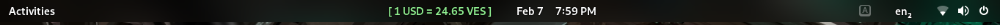

# dollar-to-brl
```
Gnome-Shell Extension (41.x,42.x), for conversion dollar USD to Bs, I use DolarTodar API as reference.
```

# Licence
```
This program is free software: you can redistribute it and/or modify

it under the terms of the GNU General Public License as published by
the Free Software Foundation, either version 2 of the License, or
(at your option) any later version.
This program is distributed in the hope that it will be useful,
but WITHOUT ANY WARRANTY; without even the implied warranty of
MERCHANTABILITY or FITNESS FOR A PARTICULAR PURPOSE.  See the
GNU General Public License for more details.
You should have received a copy of the GNU General Public License
along with this program.  If not, see <http://www.gnu.org/licenses/>.
SPDX-License-Identifier: GPL-2.0-or-later
```


# How to install
```bash
cd /tmp 
git clone  https://github.com/it6c65/gnome-dollar-ven.git
mv gnome-dollar-ven dollar-ve@it6c65.github.com
cp -av gnome-dollar-ven ~/.local/share/gnome-shell/extensions/ 
gnome-shell-extension-tool --enable-extension dollar-ve@it6c65.github.com 
rm -rf dollar@dotpyc.com
```
To restart GNOME Shell in X11, pressing Alt+F2 to open the Run Dialog and enter restart (or just r).

# Preview


